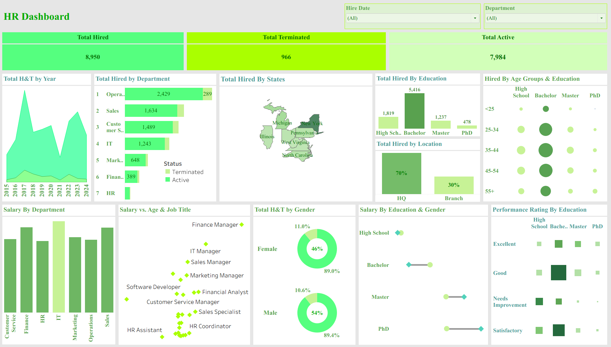

# 👥 HR Analytics Dashboard (Tableau)

## 📌 Project Overview
This project presents an HR analytics dashboard built with Tableau to analyze workforce data and support HR-related decision-making.

The dashboard focuses on understanding employee distribution, demographics, and key HR metrics, and was developed as a practical analytics exercise during training.

---

## 📊 Key Insights & Analysis
- Employee distribution by department and role
- Workforce demographics (age groups, gender, tenure)
- Headcount overview and HR-related indicators
- Patterns and trends supporting HR planning and analysis

---

## 🛠 Tools & Technologies
- Tableau
- Data Visualization
- Exploratory Data Analysis (EDA)
- HR Analytics

---

## 📁 Data Source
Sample HR dataset used for educational and training purposes.

---

## 📷 Dashboard Overview

### 

